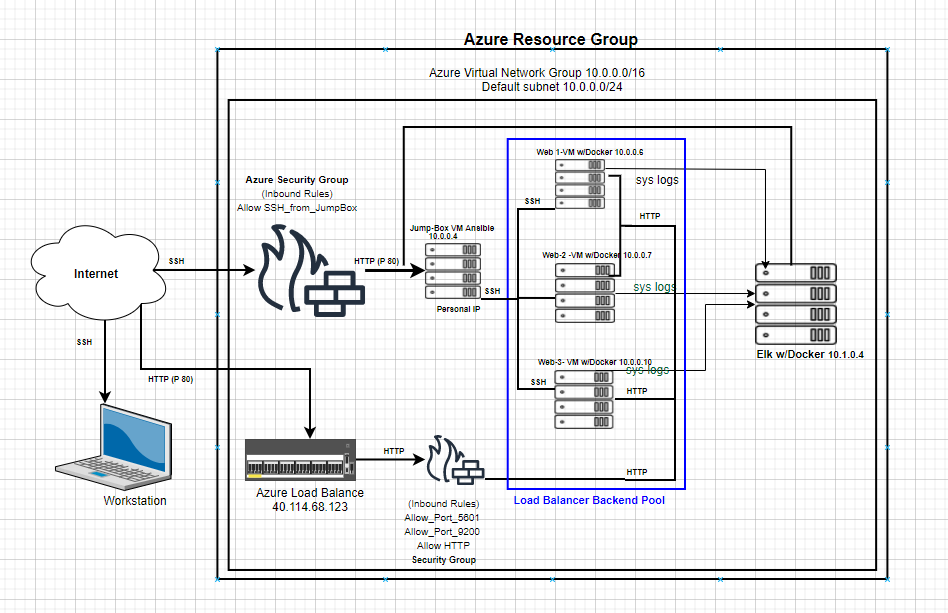
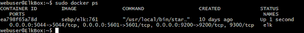
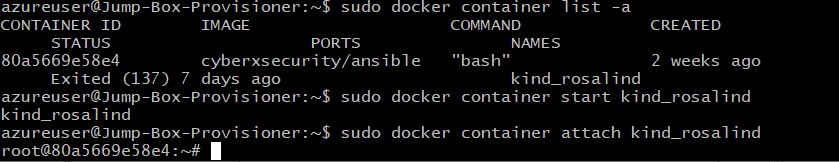

## Automated ELK Stack Deployment

The files in this repository were used to configure the network depicted below.

These files have been tested and used to generate a live ELK deployment on Azure. They can be used to either recreate the entire deployment pictured above. Alternatively, select portions of the.yml file may be used to install only certain pieces of it, such as Filebeat.

  - _The ansible-playbooks: [elk.yml](https://github.com/LaurieFRD-Cyber/Elk_Stack/blob/main/Ansible/install-elk.yml) and [filebeat-playbook.yml](https://github.com/LaurieFRD-Cyber/Elk_Stack/blob/main/Ansible/filebeat-playbook.yml) are needed to install and implement the Elk-Server._

This document contains the following details:
- Description of the Topologu
- Access Policies
- ELK Configuration
  - Beats in Use
  - Machines Being Monitored
- How to Use the Ansible Build

### Description of the Topology

The main purpose of this network is to expose a load-balanced and monitored instance of DVWA, the D*mn Vulnerable Web Application.

Load balancing ensures that the application will be highly availabile, in addition to restricting access to the network.
- _What aspect of security do load balancers protect?_ 
   In regrads to the confidentiality, integrity,and availability (CIA) Triad. Load Balancers ensure the Availability aspect of the information security.  	
- _What is the advantage of a jump box?_
   The JumpBox is a secure admin workstation which requires all administrators to connect to the JumpBox before performing any configuration for non-repudiation.

Integrating an ELK server allows users to easily monitor the vulnerable VMs for changes to the logs and system traffic.
- _What does Filebeat watch for?_
   Filebeat watches the log files and locations, and collects log events that you specify. 
- _What does Metricbeat record?_
   Metricbeat records metric and statistical data from the operating system and from services running on the server.

   The configuration details of each machine may be found below.

| Name       | Function        | IP Address | Operating System    |
|------------|-----------------|------------|---------------------|
| JumpBox    | Gateway-Ansible | 10.0.0.4   | Linux (ubuntu 18.4) |
| Web 1-VM   | DVWA - Docker   | 10.0.0.6   | Linux (ubuntu 18.4) |
| Web 2-VM   | DVWA - Docker   | 10.0.0.7   | Linux (ubuntu 18.4) |
| Web 3-VM   | DVWA - Docker   | 10.0.0.10  | Linux (ubuntu 18.4) |
| Elk Server | Elk-Docker      | 10.1.0.4   | Linux (ubuntu 18.4) |

### Access Policies

The machines on the internal network are not exposed to the public Internet. 

Only the JumpBox machine can accept connections from the Internet. Access to this machine is only allowed from the localhost's public IP Address.

Machines within the network can only be accessed by SSH.
- _Which machine did you allow to access your ELK VM? What was its IP address?_
   The only machine that is able to connect to the Elk-Server (10.1.0.4) is via JumpBox from Private IP (10.0.0.4).
   
A summary of the access policies in place can be found in the table below:

| Name       | Publicly Accessible |  Allowed IP Addresses  |
|------------|:-------------------:|:----------------------:|
| JumpBox    |          No         | Personal IP Only       |
| Web 1-VM   |          No         | 10.0.0.4               |
| Web 2-VM   |          No         | 10.0.0.4               |
| Web 3-VM   |          No         | 10.0.0.4               |
| Elk Server |          No         | 10.0.0.4 & Personal IP |

### Elk Configuration

Ansible was used to automate configuration of the ELK machine. No configuration was performed manually, which is advantageous because: 
- _The main advantages of automating configuration through Ansible is easy to use and it is extremely lightweight learning curve. Through the use of Playbooks, you are able to configure multiple Machines with the use of a single command after initial configuration._

The playbook implements the following tasks:
- Create a New VM (Note:named something simple "Elk-Server or ElkBox") Keep note of the Private IP (10.1.0.4) and the Public IP (0.0.0.0). You will need the Private IP to SSH into the VM and the Public IP to connect to the Kibana Portal (HTTP Site) to view all Metrics/Syslogs.
- Download and Configure the "elk-docker" container "In the hosts.conf you will need to add a new group [elkservers] and the Private IP (10.1.0.4) to the group. Then you need to create a new ansible-playbook [elk.yml](https://github.com/LaurieFRD-Cyber/Elk_Stack/blob/main/Ansible/install-elk.yml) that will download, install, configure the "Elk-Box" to map the following ports [5601,9200,5044], and start the container.
- Launch and expose the container "After installing and starting the new container. You can verify that the container is up and running by SSHing into the container from your JumpBox. Once you are in the “Elk-Box” run the command [sudo docker ps -a]

The following screenshot displays the result of running `docker ps` after successfully configuring the ELK instance.

### Target Machines & Beats
This ELK server is configured to monitor the following machines with IP addresses:

-_[10.0.0.4, 10.0.0.6, 10.0.0.7, 10.0.0.10]_

We have installed the following Beats on these machines:
- _Filebeat and Metricbeatd_

These Beats allow us to collect the following information from each machine:
- _Filebeat is a lightweight shipper for forwarding and centralizing log data. Filebeat monitors log files and locations you specify, collects log events, and forwards them to Elasticsearch for indexing._
-_Metricbeat collects metrics from the operating system and from services running on the server. Metricbeat then takes the metrics and statistics that it collects and ships them to the output that you specify._

### Using the Playbook
In order to use the playbook, you will need to have an Ansible control node already configured. Assuming you have such a control node provisioned: 

SSH into the control node and follow the steps below:
- Copy the [filebeat-playbook.yml](https://github.com/LaurieFRD-Cyber/Elk_Stack/blob/main/Ansible/filebeat-playbook.yml)file to the /etc/ansible/roles/files/.
- Update the configuration files to include the private IP address of teh Elk-Server to the ElasticSearch and Kibana section of the configuration file.
  The file you need to update is the filebeat-config.yml which is a configuration file that will be dropped into the Elk-Server during the run of the ansible-playbook. When you update the host.cfg file in the ansible directory you will need to create a new group called [elkbox] and add the Private IP of the Elk-Box to the group. When configuring the filebeat.yml file, you need to designate the Private IP of the Elk-Server in two lines of the .yml file. Lines 1106 and 1806 are needed to be updated with the Private IP.
 
- Run the playbook, and navigate to filebeat-playbook.yml to check that the installation worked as expected.
  
- _Which file is the playbook? Where do you copy it?_
   The playbook is called filebeat-playbook.yml and it is copied in the "/etc/ansible/hosts/" directory.
- _Which file do you update to make Ansible run the playbook on a specific machine? How do I specify which machine to install the ELK server on versus which to install Filebeat on?_
- _Which URL do you navigate to in order to check that the ELK server is running?
   Your Elk-server's Public IP address (0.0.0.0:5601) or  curl localhost:5601/app/kibana
_The commands needed to run the Ansible configuration for the Elk-Server are:

  -ssh azureadmin@JumpBox(PublicIP)
  -sudo docker container list -a (locate your ansible container)
  -sudo docker start container (name of the container)
  -sudo docker attach container (name of the container)
   
  -ansible-playbook elk.yml (configures Elk-Server and starts the Elk container on the Elk-Server) wait a couple minutes for the implementation of the Elk-Server
  -ansible-playbook filebeat-playbook.yml (installs Filebeat and Metricbeat)

  
